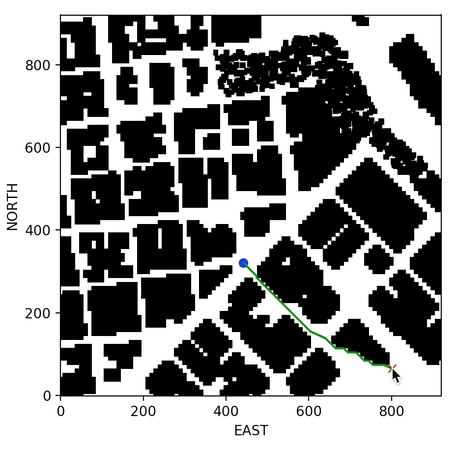
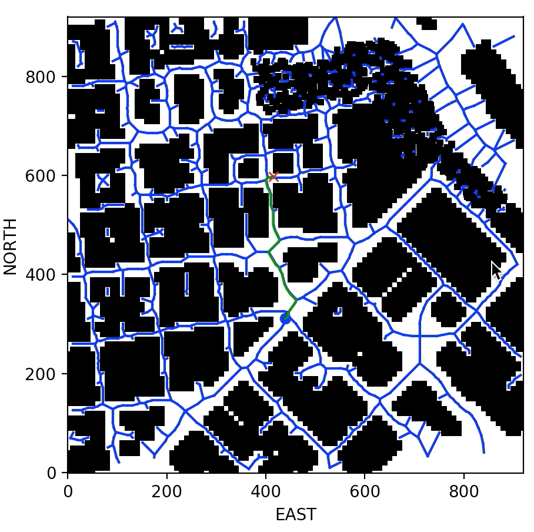
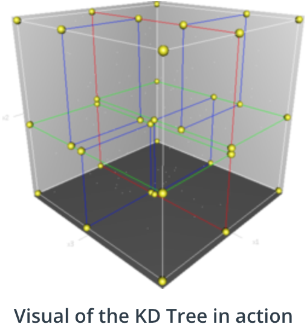
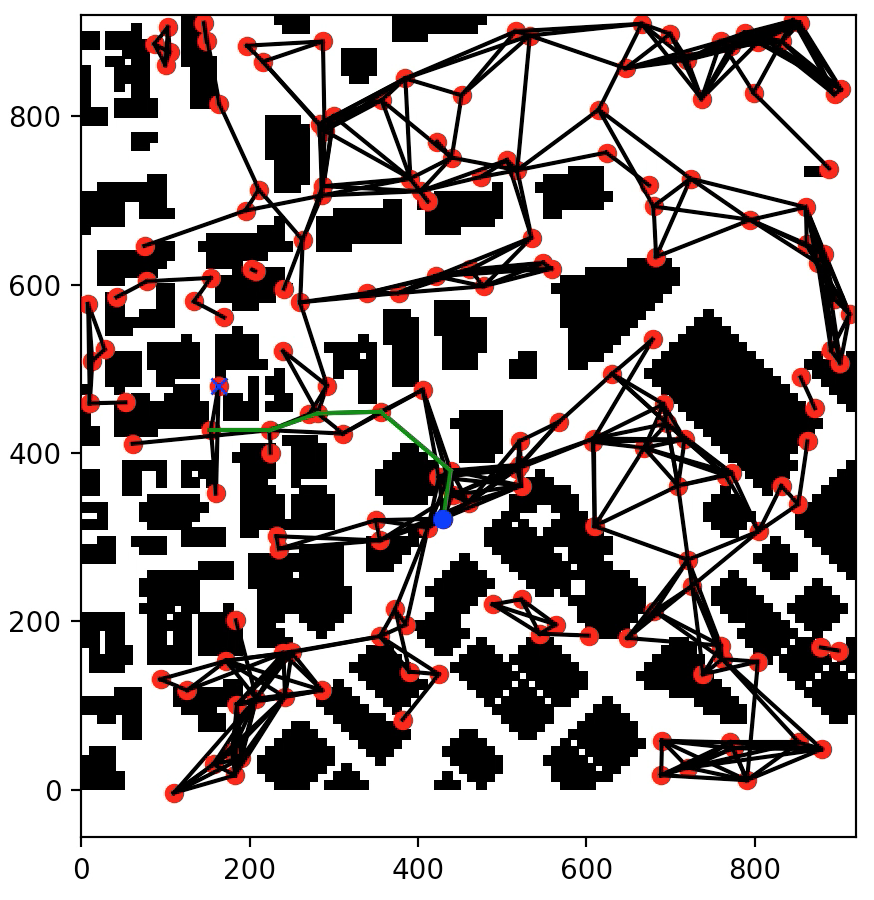

# Project: 3D Motion Planning


---
## Overview
This poject demostrate how the drone fly from the start to goal location through the 2.5D map. Discretize the enviroment into a grid & graph representation. Use A* search algorithm to find the shortest path. More detail information about simulator and python environment setup can be found [here](https://github.com/hayaalsh/FCND-Motion-Planning/blob/master/README_Udacity.md).

All the code of implementation can be found here

file name | function |
--- | ---
motion_planning_grid_map.py | Grid Based Implementation 
motion_planning_graph_map.py| Graph Based Implementation 
motion_planning_probabilistic_roadmap.py | Probabilistic Roadmap Algorithm


## Load 2.5D map
Due to my computure is not fast enough to finish the path planning within the simulator connection timeout. So I have to preload the map and finish the path planning before connecting to simulator. I designed a class call MapData to do so.

All the map data will be load while MapData intitialize. A grid for a particular altitude and safety margin around obstacles will also be build. To create the grid using ```create_grid()``` in ```grid_search.py```

```
 # read lat0, lon0 from colliders into floating point values
 header = open(map_file_name).readline()
 s = re.findall(r"[-+]?\d*\.\d+|\d+", header)
 self.lat_0 = float(s[1]) #global hoome position of drone
 self.lon_0 = float(s[3])

 # Read in obstacle map
 data = np.loadtxt(map_file_name, delimiter=',', dtype='Float64', skiprows=2)
        
 # Define a grid for a particular altitude and safety margin around obstacles
 self.grid, self.north_offset, self.east_offset = create_grid(data, self.TARGET_ALTITUDE, self.SAFETY_DISTANCE)
```

The home position will be set while the drone arming.
To set the global home position using ```self.set_home_position().```

```
   def arming_transition(self):
        self.flight_state = States.ARMING
        print("<arming transition>")
        self.arm()
        self.take_control()
        self.set_home_position(self.lon_0, self.lat_0, 0)
        print(f'Home lat : {self.lat_0}, lon : {self.lon_0}')
```

## Path Planning
### Grid Based Implementation
In ```motion_planning_grid_map.py``` , you can choose the start and goal location. But the start location should be close to the home loaction of drone. So the drone will fly though the path.

The video of this implementation can be found [here](https://youtu.be/txL9tiy-9wo).



### A* search with diagonal motion
In ```grid_search.py``` , the ```a_stat()``` calculate the shortest path and check if the note is valid or not by using  ```valid_actions(grid, current_node)```. The ```action()``` enum class define the actions. So the following code were added for diagonal motion accordingly.

```
    if x + 1 > n or y + 1 > m or grid[x + 1, y + 1] == 1:
        valid_actions.remove(Action.SOUTH_EAST)
    if x - 1 < 0 or y + 1 > m or grid[x - 1, y + 1] == 1:
        valid_actions.remove(Action.NORTH_EAST)
    if x + 1 > n or y - 1 < 0 or grid[x + 1, y - 1] == 1:
        valid_actions.remove(Action.SOUTH_WEST)
    if x - 1 < 0 or y - 1 < 0 or grid[x - 1, y - 1] == 1:
        valid_actions.remove(Action.NORTH_WEST)
```

The cost of diagonal motions is sqrt(2)
```
    SOUTH_EAST = (1, 1, np.sqrt(2))
    NORTH_EAST = (-1, 1, np.sqrt(2))
    SOUTH_WEST = (1, -1, np.sqrt(2))
    NORTH_WEST = (-1, -1, np.sqrt(2))
```

## Remove unnecessary waypoints
After path planing, run collinearity test to remove unnecessary waypoints by calling ```prune_path()```.

```
def prune_path(path, epsilon=1e-5):
    """
    Returns prune path.
    """
    def point(p):
        return np.array([p[0], p[1], 1.]).reshape(1, -1)

    def collinearity_check(p1, p2, p3):   
        m = np.concatenate((p1, p2, p3), 0)
        det = np.linalg.det(m)
        return abs(det) < epsilon

    pruned_path = [p for p in path]
    i = 0
    while i < len(pruned_path) - 2:
        p1 = point(pruned_path[i])
        p2 = point(pruned_path[i+1])
        p3 = point(pruned_path[i+2])

        if collinearity_check(p1, p2, p3):
            pruned_path.remove(pruned_path[i+1])
        else:
            i += 1
    return pruned_path
```


### Graph Based Implementation
In ```motion_planning_graph_map.py``` , you choose the start and goal location. A graph with edges is created by using ```create_graph_and_edges()``` in ```graph_search.py```. The closet notes will be found according to the locations, then use the ```a_star()``` to calculate shortest path according to the graph.

The video of this implementation can be found [here](https://youtu.be/8HhC1Rl7rmI).




### Probabilistic Roadmap Algorithm
In ```motion_planning_probabilistic_roadmap.py```, you choose the start and goal location. A graph with random notes is created by using ```create_graph_with_nodes()``` in ```probabilistic_roadmap.py```. While creating the graph, I used the KD Tree data structure to quickly identify nearest neighbors to a point or polygon. The total search time down to O(m * log(n)) from O(m*n), where m is the number of elements to compare to and n is the number of elements in the KD Tree. 




The notes which are collide with obstacles will be discard by using ```can_connect()```. 

```
def can_connect(n1, n2):
    l = LineString([n1, n2])

    global polygons
    for p in polygons:
        if p.crosses(l) and p.height >= min(n1[2], n2[2]):
            return False
    return True
```


Then use the ```a_star()``` to calculate shortest path according to the graph. The video of this implementation can be found [here](https://youtu.be/DPHO8Zf3YFg).




